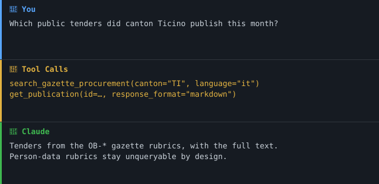

> 🇨🇭 **Teil des [Swiss Public Data MCP Portfolio](https://github.com/malkreide)**

# 📰 amtsblatt-mcp


[](https://opensource.org/licenses/MIT)
[](https://www.python.org/downloads/)
[](https://modelcontextprotocol.io/)
[](https://github.com/malkreide/amtsblatt-mcp)


> MCP-Server für **amtsblattportal.ch** — das Schweizer Amtsblattportal
> (SHAB + 27 kantonale Amtsblätter). Öffentliche Beschaffung und amtliche
> Bekanntmachungen, **Rubriken mit Personendaten bewusst ausgeschlossen**.

[🇬🇧 English version](README.md)

## Übersicht

Das Amtsblattportal publiziert rund **2,79 Millionen** amtliche Bekanntmachungen:
öffentliche Beschaffung, kantonale und kommunale Mitteilungen, Beschlüsse,
Raumplanung — aber auch Konkurse, Schuldbetreibungen, Schuldenrufe und
Zivilstandseinträge, die natürliche Personen namentlich nennen.

Dieser Server erschliesst nur die erste Gruppe. Rubriken mit systematischen
Personendaten sind **nicht durchsuchbar**, und kein Tool akzeptiert Namen,
Geburtsdatum oder Adresse einer Person. Das ist ein bewusster
Datenschutz-Entscheid, erläutert unter [Datenschutz & Scope](#datenschutz--scope).

**Anker-Demoabfrage:** *«Welche öffentlichen Ausschreibungen hat der Kanton
Tessin diesen Monat publiziert?»*
→ `gazette_search_procurement(canton="TI", only_language=True, language="it")` → `gazette_get_publication(id=…)`

### Demo



Für Beschaffung in jedem anderen Kanton — auch Zürich, Bern und Basel-Stadt —
ist [`swiss-procurement-mcp`](https://github.com/malkreide/swiss-procurement-mcp)
zuständig; siehe [Die Grenze zu `swiss-procurement-mcp`](#die-grenze-zu-swiss-procurement-mcp).

## Funktionen

- **Fail-closed Freigabe-Liste** — 49 erschlossene von 152 Rubriken; alles
  andere ist standardmässig gesperrt, auch später hinzukommende Rubriken
- **Erklärende Absagen** — eine gesperrte Rubrik liefert das *Warum*, nie ein
  stilles leeres Ergebnis und nie einen Umgehungshinweis
- **Beschaffungs-Logik** — kennt die Tatsache, dass nur noch AR und TI hier
  ausschreiben, dass BS im Lauf von 2024 ausgelaufen ist, BL und VS historische
  Archive sind, `OB-ZG` nach dem simap-Wechsel nie befüllt wurde und ZH
  vollständig über simap.ch läuft — und erklärt das, statt nichts zu liefern.
  Aktivität wird [gemessen, nicht am Rubrik-Label abgelesen](docs/procurement-coverage.md)
- **Fristberechnung** in Europe/Zurich, der rechtlich relevanten Zeitzone
- **Ehrliche Trefferzahlen bei Mehrsprachigkeit** — das Portal publiziert je
  Sprache einen eigenen Datensatz mit *eigener* Publikationsnummer; identische
  Fassungen werden zusammengefasst, übersetzte über `language_mix` ausgewiesen
  statt geraten, und `only_language=True` liefert eine einzelne Sprachfassung
- **Defensives XML-Parsing** — das Schema ist pro Subrubrik verschieden; kein
  rubrikspezifischer Pfad ist hartcodiert, HTML-escapte Texte werden bereinigt
- **Egress-Allow-List**, Retry mit Backoff, strukturiertes JSON-Logging
- **Markdown- oder JSON-Ausgabe** mit Attribution und `provenance`

## Voraussetzungen

- Python 3.11+
- **Kein API-Key.** Die Lese-API von amtsblattportal.ch ist frei zugänglich.

## Installation

```bash
pip install amtsblatt-mcp
# oder ohne Installation:
uvx amtsblatt-mcp
```

Aus dem Quellcode:

```bash
git clone https://github.com/malkreide/amtsblatt-mcp
cd amtsblatt-mcp
pip install -e ".[dev]"
```

## Konfiguration

### Claude Desktop

```json
{
  "mcpServers": {
    "amtsblatt": {
      "command": "uvx",
      "args": ["amtsblatt-mcp"]
    }
  }
}
```

### Cloud-Deployment (streamable-http)

```bash
export MCP_TRANSPORT=streamable-http
export MCP_API_KEY="$(openssl rand -hex 32)"   # Pflicht — Start bricht sonst ab
export PORT=8000
amtsblatt-mcp
```

Der Endpunkt ist **`/mcp`**.

> **Umstieg von SSE.** Bis 0.18.0 sprach dieser Server ausschliesslich SSE, auf
> `/sse` + `/messages`. Die MCP-Spec `2026-07-28` stuft HTTP+SSE mit
> Zwölf-Monats-Frist als deprecated ein und entfernt Sessions aus dem Protokoll;
> streamable-http ist deshalb jetzt der Standard. `MCP_TRANSPORT=sse` läuft
> weiter und trägt weiterhin den vollständigen Stack aus Bearer-Auth,
> Rate-Limit und CORS — beim Start wird eine Warnung mit der Frist geloggt.
> **Beim Umstellen die Client-URL anpassen**: der Pfadwechsel ist der Teil, der
> stillschweigend bricht.

| Variable | Standard | Zweck |
|---|---|---|
| `MCP_TRANSPORT` | `stdio` | `stdio`, `streamable-http` (Alias `http`) oder das abgekündigte `sse` |
| `MCP_HOST` | `127.0.0.1` | HTTP-Bind-Adresse. Standard Loopback; `0.0.0.0` exponiert auf allen Interfaces (das Docker-Image setzt das bewusst). |
| `MCP_STATELESS` | _(nicht gesetzt)_ | `1` betreibt streamable-http ganz ohne Session-Tracking. Damit entfallen Session-Hijacking und Session-Affinität als Fragen, statt beantwortet zu werden (`SEC-009`, `SCALE-002`). Opt-in, weil ein zustandsloser Server einen unterbrochenen Stream nicht fortsetzen und keine servergetriebenen Notifications senden kann. Auf `sse` wirkungslos — dort gibt es keinen Stateless-Modus. |
| `MCP_CORS_ORIGINS` | _(nicht gesetzt)_ | Kommagetrennte Origins, die den Endpunkt aus dem Browser aufrufen dürfen. Nicht gesetzt heisst: kein Cross-Origin-Zugriff aus dem Browser — stdio und Nicht-Browser-Clients sind nicht betroffen. Für die gelisteten Origins wird `Mcp-Session-Id` exponiert und akzeptiert, damit ein Browser-Client eine Session halten kann. `*` wird akzeptiert, loggt aber eine Warnung und deaktiviert Credentials, weil Browser eine Wildcard-Origin zusammen mit Credentials ablehnen. |
| `MCP_API_KEY` | — | Bearer-Token; **Pflicht** auf jedem HTTP-Transport |
| `MCP_RATE_LIMIT` / `MCP_RATE_WINDOW` | `60` / `60` | Sliding-Window-Rate-Limit |
| `RUBRICS_TTL` | `86400` | Cache-TTL der Taxonomie (Sekunden) |
| `LOG_LEVEL` | `INFO` | Strukturierte JSON-Logs auf stderr |

## Verfügbare Tools

| Tool | Signatur | Hinweise |
|---|---|---|
| `gazette_search_publications` | `(keyword?, rubric?, sub_rubric?, canton?, date_start?, date_end?, limit=20, page=0, language='de', only_language=False)` | Nur freigegebene Rubriken. Ohne `rubric` werden alle grünen Rubriken injiziert — eine reine Stichwortsuche erreicht nie eine gesperrte. |
| `gazette_search_procurement` | `(keyword?, canton?, date_start?, date_end?, include_inactive=False, limit=20, page=0, language='de', only_language=False)` | `OB-*`-Rubriken plus die eigenständigen Subrubriken `AR-VS40`, `AR-OW40`, `BA-SH40`. Ein Kanton ohne beides erhält die simap.ch-Erklärung und **keinen HTTP-Call**. Kein CPV — die Quelle kennt keines. |
| `gazette_get_publication` | `(id, response_format='markdown')` | Amtlicher Volltext aus dem XML. Prüft die Rubrik nach dem Abruf erneut; Inhalt einer gesperrten Rubrik wird verworfen. |
| `gazette_list_rubrics` | `(language='de', rubric_class='green', response_format='markdown')` | `rubric_class='all'` zeigt die vollständige Taxonomie mit Ampelklassen und Begründung — aufgeführt heisst nicht durchsuchbar. |
| `gazette_source_status` | `(response_format='markdown')` | Erreichbarkeit, Latenz, Cache-Alter, Scope-Kennzahlen. |

Alle Tools sind `readOnlyHint=True`.

### Anwendungsbeispiele

| Frage | Tool-Kette |
|---|---|
| Ausschreibungen im Tessin dieses Quartal | `gazette_search_procurement(canton="TI", only_language=True, language="it")` |
| Beschaffung, die simap.ch **nicht** hat | `gazette_search_procurement(canton="VS")` — 150 Walliser Zuschläge, keiner auf simap |
| Ausschreibungen in jedem anderen Kanton | → [`swiss-procurement-mcp`](https://github.com/malkreide/swiss-procurement-mcp) |
| Was ist hier überhaupt abfragbar? | `gazette_list_rubrics()` |
| Warum kann ich keine Konkurse suchen? | `gazette_list_rubrics(rubric_class="all")` |
| Zonenplanänderungen in Zürich | `gazette_search_publications(rubric="RP-ZH")` |
| Volltext einer Bekanntmachung | `gazette_get_publication(id="fbf0ff9e-…")` |
| Alles zu einer bestimmten Firma | → [`register-mcp`](https://github.com/malkreide/register-mcp) |

## Datenschutz & Scope

Das Amtsblattportal publiziert systematisch Personendaten **natürlicher**
Personen. Diese Publikationen sind öffentlich — aber sie über einen KI-Agenten
*systematisch namentlich durchsuchbar* zu machen, ist eine Zweckentfremdung, die
die Publikation nie beabsichtigt hat, und nach revidiertem DSG (revDSG) ein
Profiling-Instrument.

Daraus folgen vier Regeln, durchgesetzt im Code, nicht in der Dokumentation:

1. **Allow-List, nie Block-List.** Nicht ausdrücklich grün ⇒ nicht abfragbar.
   Neue Rubriken der Quelle sind standardmässig geschlossen.
2. **Kein Personen-Sucheinstieg** in irgendeiner Tool-Signatur.
3. **Keine Persistenz.** Publikationen haben gesetzliche Löschfristen; ein
   Cache, der sie überdauert, würde sie aktiv unterlaufen. Nur die *Taxonomie*
   wird zwischengespeichert.
4. **Gesperrt ⇒ erklärt.** Nie ein stilles leeres Ergebnis, nie ein Hinweis auf
   eine Umgehung.

### Was ausgeschlossen ist

🔴 Konkurse (`KK`), Schuldbetreibungen (`SB`), Schuldenrufe (`LS`, `SR`),
Nachlass (`NA`), Erbschaft/Testament/Ableben (`ES`, `TE-*`, `VA-*`),
Familie & Zivilstand (`FZ-*`, `BV-*`, `BU-*`), gerichtliche Vorladungen
(`UV`, `GB-*`, `GE-*`, `SJ-BE`), Baugesuche (`BP-*`), Grundbuch (`GR-*`),
Meldungskatalog GR (`AA-GR`).

🟡 Zurückgestellt: Steuerwesen, Anzeigen, Bewilligungen, Bildungs- und
Kirchenwesen sowie die allgemeinen Sammelrubriken.

Der vollständige Audit-Trail — inklusive drei dokumentierter Erweiterungen
gegenüber der Ausgangsspezifikation — steht in
[`docs/rubric-classification.md`](docs/rubric-classification.md).

**Wie viel hinter jedem Entscheid steht, ist gemessen und nicht geschätzt.**
[`docs/coverage-matrix.md`](docs/coverage-matrix.md) enumeriert die Rubrikenachse
der Quelle und markiert die Reichweite dieses Servers hinein: **84,2 % von
2 804 063 Publikationen sind erreichbar, 12,6 % bewusst gesperrt, 3,3 % noch
unklassifiziert**. Allein die Insolvenz-Gruppe umfasst 321 704 Publikationen —
in der Quelle vorhanden, hier absichtlich ausserhalb der Reichweite. Ohne diese
Zahl lesen sich «ausserhalb des Scopes» und «nicht in der Quelle» in einem
Review gleich, und genau dieser Fehler ist diesem Repo einmal passiert (siehe
`ARCH-003` in [`SECURITY.md`](SECURITY.md)).

### Die Grenze zu `register-mcp`

Für Publikationen zu einer bestimmten **Firma** gibt es
[`register-mcp`](https://github.com/malkreide/register-mcp). Dort besteht voller
Rubrikzugriff — inklusive des eigenen Konkurses einer Firma — aber immer nur
über die Firmen-**UID**. Der Konkurs einer Firma ist Unternehmensdatum, kein
Profiling natürlicher Personen, und die UID-Bindung macht eine namentliche
Enumeration unmöglich.

`amtsblatt-mcp` hat die umgekehrte Form: breite Suche, enge Rubriken. Der
`uids`-Parameter der Quelle wird hier gar nicht erst angeboten.

### Die Grenze zu `swiss-procurement-mcp`

**simap.ch ist die Primärquelle für die öffentliche Beschaffung** — alle 26
Kantone plus Bund, mit CPV- und BKP-Codes, Zuschlägen und Publikationsverlauf.
Für Beschaffungsfragen ist
[`swiss-procurement-mcp`](https://github.com/malkreide/swiss-procurement-mcp)
zuständig.

**amtsblattportal.ch ist die Primärquelle für amtliche Bekanntmachungen** —
Handelsregister, Raumplanung, Erlasse, kantonale und kommunale Mitteilungen.
Dafür gibt es diesen Server; Beschaffung sind 6 seiner 49 freigegebenen Rubriken.

Beschaffung ist hier weitgehend eine **Zweitpublikation** derselben
Ausschreibungen — und das ist inzwischen gemessen, nicht vermutet. Das XML einer
Publikation trägt `<simapPublicationNumber>`, wenn sie von simap.ch stammt; damit
joinen die beiden Korpora exakt. Über den vollständigen `OB-TI`-Jahrgang 2026
tragen **503 von 546 Datensätzen (92,1 %)** eine solche Nummer; drei der sechs
`OB-*`-Rubriken sagen es schon im eigenen Label (`OB-BL` — «über Simap importiert
(I N A K T I V)»).

Die Ausnahme ist klein und scharf begrenzt: `AR-VS40` (Wallis, 150 Zuschläge),
`AR-OW40` (Obwalden, 7), `BA-SH40` (Schaffhausen, 2) und die Ticiner Subrubrik
`OB-TI65` («Avvisi di gara **non CIAP**») tragen **keine** simap-Referenz. Das
ist der einzige Teil der hiesigen Beschaffungsabdeckung, den
`swiss-procurement-mcp` nicht erreicht — `gazette_search_procurement` liefert ihn
für VS, OW und SH, obwohl diese Kantone keine aktive `OB-*`-Rubrik haben. Zahlen
und Methode in [`docs/simap-overlap.md`](docs/simap-overlap.md).

Die beiden Server bleiben bewusst getrennt: unterschiedliche Quellen,
unterschiedliche Nutzungsbedingungen — und ein fail-closed Rubrik-Gate, das nur
etwas wert ist, solange es *jedes* Tool des Servers abdeckt. Die Zahlen stehen in
[`docs/procurement-coverage.md`](docs/procurement-coverage.md).

## Reifegrad & Phase

**Phase 1 — rein lesend.** Alle sechs Tools sind lesend; es gibt keinen
Schreibpfad und es ist keiner geplant. Siehe [ROADMAP.md](ROADMAP.md) für den
phasenspezifischen Backlog, das bewusst nicht Geplante und die Voraussetzungen
eines Phasenwechsels.

Die wichtigere Einschränkung ist hier nicht die Phase, sondern die **grüne
Allow-List** — Rubriken mit systematischen Personendaten sind nicht abfragbar,
im Code durchgesetzt und nach jedem Abruf erneut geprüft. Das ändert sich mit
der Phase nicht. Siehe [Datenschutz & Scope](#datenschutz--scope).

SDK- und Abhängigkeits-Updates kommen als
[Dependabot](.github/dependabot.yml)-PRs, damit eine brechende Protokoll- oder
SDK-Änderung bewusst geprüft wird statt still zu driften.

---

## Architektur

```
   Claude / MCP-Client
            │
      amtsblatt-mcp
            │
   ┌────────┴────────┐
   │  Green Gate     │  ← rubrics.py: fail-closed Allow-List
   └────────┬────────┘     (geprüft im Tool UND im Query-Builder)
            │
   ┌────────┴────────┐
   │  Parameter-     │  ← Silent-Ignore-Schutz
   │  Allow-List     │  ← Silent-Empty-Schutz (Taxonomie-Validierung)
   └────────┬────────┘  ← Plausibilitätsprüfung (Korpusgrösse)
            │
   ┌────────┴────────┐
   │ Egress-Allow-   │
   │ List (httpx)    │
   └────────┬────────┘
            │
  amtsblattportal.ch/api/v1
   /publications · /publications/{id}/xml · /rubrics · /tenants
```

**Architektur A (nur Live-API).** Die Endpunkte antworten stabil ohne
Authentifizierung, daher wird kein Bulk-Dump gepflegt.

### Verifizierte Eigenheiten der Quelle (live geprüft 2026-07-20)

| Eigenheit | Verhalten | Schutz |
|---|---|---|
| **Silent Ignore** | Ein unbekannter Parameter*name* liefert HTTP 200 und den **vollen Korpus**. `canton=ZH` (Singular-Tippfehler) verwirft den Filter still. | Query-Parameter ausschliesslich aus `ALLOWED_GAZETTE_PARAMS`; Plausibilitätsprüfung verwirft Ergebnisse > 2 000 000. |
| **Silent Empty** | Ein unbekannter Rubrik*wert* liefert HTTP 200 mit `total: 0` — ununterscheidbar von einem echten Nulltreffer. | Jeder Code wird **vor** dem Call gegen die Taxonomie validiert. |
| **Nur Metadaten** | Listen-Endpunkt und `GET /publications/{id}` liefern beide `content: null`. | Volltext nur über `/publications/{id}/xml`. |
| **Sortierung ignoriert** | `pageRequest.sortOrders` wird mit 200 akzeptiert, bleibt aber wirkungslos; `sortOrders` kommt als `[]` zurück. | Clientseitig sortiert. |
| **Fehlendes `publicationStates`** | Liefert **401**, nicht 400 — bedeutet *nicht*, dass Zugangsdaten nötig sind. | Wird immer injiziert; die 401-Meldung sagt das. |
| **Keine Seitengrössen-Grenze** | `pageRequest.size=2000` liefert 2000 Einträge. | Clientseitige Grenze von 100. |
| **Inkonsistente Pluralformen** | `rubrics`/`cantons`/`subRubrics` sind Plural, `keyword`/`tenant` Singular. | Exakte Schreibweisen kodiert, keine Pluralisierungsregel. |

## Bekannte Einschränkungen

- **Ungleiche kantonale Abdeckung.** Nur 16 von 29 Mandanten publizieren eine
  eigene Rubriktaxonomie; AG, FR, GE, GL, JU, LU, NE, UR sind noch unvollständig.
- **Löschfristen.** Publikationen fallen mit der Zeit aus der API — daher nur
  Durchreichen, keine Persistenz.
- **Beschaffungsgrenze.** Die meisten Kantone, auch **Zürich**, publizieren
  Ausschreibungen über simap.ch ausserhalb dieses Portals. Es gibt kein
  `OB-ZH`, und CPV-Klassifikation existiert hier nicht. Was dieses Portal hat
  und simap nicht, steht in [`docs/simap-overlap.md`](docs/simap-overlap.md);
  `gazette_get_publication` weist `simap_publication_number` aus, sodass Spiegel und
  Original unterscheidbar sind.
- **Beschaffungsabdeckung, gemessen** (`publicationStates=PUBLISHED`, 2026-07-27,
  Datensätze pro Kalenderjahr — reproduzierbar mit
  `python scripts/measure_procurement_coverage.py`):

  | Rubrik | 2022 | 2023 | 2024 | 2025 | 2026 | Neueste | Status |
  |---|---|---|---|---|---|---|---|
  | `OB-TI` | 517 | 491 | 625 | 607 | 546 | 2026-07-27 | aktiv |
  | `OB-AR` | 95 | 85 | 79 | 56 | 40 | 2026-05-22 | aktiv |
  | `OB-BS` | 1 149 | 1 058 | 319 | 15 | **2** | 2026-05-20 | im Lauf von 2024 ausgelaufen |
  | `OB-VS` | 0 | 1 052 | 1 | 0 | 0 | 2024-01-05 | Archiv — simap-Import bis Ende 2023 |
  | `OB-BL` | 0 | 74 | 0 | 0 | 0 | 2023-03-30 | Archiv — als «I N A K T I V» beschriftet |
  | `OB-ZG` | 0 | 0 | 0 | 0 | 0 | — | nie befüllt |

  **Aktiv publizieren nur noch TI und AR.** `OB-BS` ist der lehrreiche Fall: Das
  Label lautet schlicht «Öffentliches Beschaffungswesen» ohne Inaktiv-Marker —
  nur das Volumen verrät den Wechsel. Genau deshalb wird `active` gemessen und
  nicht gelesen. Mit `include_inactive=True` sind die Archive von BS, BL und VS
  erreichbar. Details in [`docs/procurement-coverage.md`](docs/procurement-coverage.md).
- **Kein Push.** Nur Polling; kein Abo- oder Webhook-Mechanismus.
- **Rechtsverbindlich** ist das signierte PDF, nicht diese API.

## MCP Protocol Version

| | |
|---|---|
| **Unterstützte Spec-Version** | `2026-07-28` |
| **Gepinnt in** | `MCP_PROTOCOL_VERSION` in [`_app.py`](src/amtsblatt_mcp/_app.py), re-exportiert über `server.py` |
| **SDK** | `mcp[cli]>=2.0.0,<3` |
| **Cache-Hinweise** | `tools/list` und `server/discover`: `ttlMs` 300000, `cacheScope` `public` |

Das MCP-Python-SDK handelt die Protokollversion in der Session-Schicht aus und
bietet dafür keinen Konstruktor-Parameter — die Version lässt sich also nicht
per Konfiguration pinnen. Sie ist als deklarierte Konstante gepinnt und wird
durch Erkennung durchgesetzt:

- **Zur Laufzeit** loggt eine Abweichung zwischen Konstante und SDK ein
  `protocol_version_drift`-Event auf `WARNING`. Der Server läuft weiter.
- **In der CI** schlägt `tests/test_protocol_version.py` fehl.

Diese Trennung ist Absicht: ein SDK-Bump soll *unseren* Build brechen, nicht die
Laufzeit von jemandem, der `mcp` in seiner eigenen Umgebung aktualisiert hat.

### Update-Policy

- Dependabot öffnet monatlich SDK-Update-PRs (`.github/dependabot.yml`).
- Verschiebt ein SDK-Update die Protokollversion, schlägt der CI-Test fehl. Die
  Lösung ist **nicht**, die Konstante blind anzupassen: erst das Spec-Changelog
  lesen, das Serververhalten prüfen, dann Konstante, diesen Abschnitt und
  `CHANGELOG.md` in einem Commit anheben.
- Protokollversions-Bumps stehen explizit im `CHANGELOG.md`.

### Cache-Hinweise

Spec `2026-07-28` gibt jedem cachebaren Resultat ein `ttlMs` und ein
`cacheScope`. Das SDK setzt beides auf «sofort veraltet, nie geteilt» — ein
Server, der kein `cache_hints` übergibt, verhält sich also nicht neutral,
sondern lässt jeden Client bei jeder Verbindung neu auflisten. Die Werkzeugliste
dieses Servers wird beim Import registriert und ist für jeden Aufrufer dieselbe;
sie wird deshalb als fünf Minuten gültig und über Autorisierungskontexte hinweg
teilbar angekündigt (`CACHE_HINTS` in `_app.py`).

`public` folgt aus dieser zweiten Eigenschaft, nicht aus Bequemlichkeit: die
Freigabeliste greift pro Anfrage in den Werkzeugen, nie dadurch, dass ein
Werkzeug jemandem verborgen bliebe. Sobald eine Werkzeugliste vom Aufrufer
abhängt, muss der Scope im selben Commit auf `private` wechseln.

---

## Primitive: nur Tools

Dieser Server exponiert **Tools** und weder Resources noch Prompts — eine
Entscheidung, kein Versäumnis (ARCH-008).

**Warum keine Resources.** Resources adressieren identifizierbare, auflistbare
Inhalte, die ein Client aufzählen und cachen kann. Publikations-IDs sind hier
opak, und welche Rubrik hinter einer ID steht, ist erst *nach* dem Abruf
bekannt — genau deshalb existiert das Post-Fetch-Green-Gate. Publikationen als
Resources auszugeben hiesse entweder ungegatete IDs herauszugeben oder trotzdem
beim Abruf zu gaten; dann bringt die Abstraktion nichts und kostet einen zweiten
Inhaltspfad. Version 0.6.0 hat gezeigt, was das kostet: das aggregierte Tool
brauchte das Gate in einem gemeinsamen Helper, weil ein zweiter Pfad genau die
Stelle ist, an der solche Garantien still aufhören zu gelten.

`gazette_list_rubrics` wurde konkret als Resource-Kandidat geprüft: die
Taxonomie ist endlich und langsam veränderlich. Sie bleibt ein Tool, weil sie
gefiltert und erklärt wird (grün/gelb/rot mit Begründung) — eine Resource würde
die rohe Liste liefern und die Begründung verlieren, die den Unterschied
zwischen «nicht gefunden» und «bewusst nicht angeboten» ausmacht.

**Warum keine Prompts.** Die Tool-Docstrings tragen die Anleitung dort, wo das
Modell sie liest; Prompts würden sie an einer zweiten, driftfähigen Stelle
duplizieren.

---

## Tests

```bash
pip install -e ".[dev]"
PYTHONPATH=src pytest tests/ -m "not live"   # 75 Tests, ohne Netzwerk
PYTHONPATH=src pytest tests/ -m live         # gegen die echte API
ruff check src/ tests/ scripts/
ruff format --check src/ tests/ scripts/
python scripts/check_version_sync.py
```

Das sind dieselben Gates wie in der CI, über dieselben Verzeichnisse. Das
`dev`-Extra pinnt ruff auf die Version, die auch die CI installiert — ein
lokaler Lauf und ein CI-Lauf stimmen damit überein.

Die Suite deckt den verbindlichen Portfolio-Satz ab: Suche in grüner Rubrik mit
Quell-URL, **gesperrte Rubrik → Erklärung mit null HTTP-Calls**, Kantonsfilter,
Fristberechnung in Europe/Zurich gegen ein fixes «heute», Pagination über eine
Seitengrenze, Sprach-Deduplikation, Boolean-Normalisierung und Verhalten bei
nicht erreichbarer API. Die Fixtures sind gekürzte echte Antworten, konsistent
anonymisiert — keine echten Personendaten.

## Projektstruktur

```
amtsblatt-mcp/
├── src/amtsblatt_mcp/
│   ├── rubrics.py       # Fail-closed Freigabe-Liste — der Scope-Entscheid
│   ├── server.py        # MCPServer, 5 Tools, Quirk-Schutz, XML-Parsing
│   ├── _log.py          # Strukturiertes JSON-Logging + Tool-Call-Events
│   ├── _middleware.py   # Bearer-Auth + Rate-Limit (alle HTTP-Transporte)
│   └── _otel.py         # Optionale OpenTelemetry-Anbindung
├── tests/
│   ├── test_allowlist.py    # Datenschutz-Invarianten (eigener CI-Job)
│   ├── test_search.py       # Suche, Beschaffung, Pagination, Dedup, Fehler
│   ├── test_publication.py  # XML-Parsing, Fristen, Egress-Allow-List
│   └── fixtures.py          # Anonymisierte echte Antworten
├── docs/
│   ├── rubric-classification.md   # Warum jede der 152 Rubriken offen/zu ist
│   ├── procurement-coverage.md    # Gemessene OB-*-Volumina; warum `active` gemessen wird
│   ├── coverage-matrix.md         # Gemessene Reichweite: welcher Teil des Bestands erreichbar ist
│   └── simap-overlap.md           # Spiegel vs. Original, Join über simapPublicationNumber
├── scripts/
│   ├── measure_procurement_coverage.py
│   └── measure_coverage_matrix.py
├── Dockerfile · compose.yaml      # Gehärteter Container, non-root, read-only
└── server.json                    # MCP-Registry-Manifest
```

## Changelog

Siehe [CHANGELOG.md](CHANGELOG.md).

## Mitwirken

Siehe [CONTRIBUTING.md](CONTRIBUTING.md). Änderungen an
[`src/amtsblatt_mcp/rubrics.py`](src/amtsblatt_mcp/rubrics.py) brauchen eine
explizite Begründung in der PR-Beschreibung: eine Rubrik freizugeben ist ein
Datenschutz-Entscheid, kein Feature.

## Sicherheit

Siehe [SECURITY.md](SECURITY.md) für Meldewege und Härtungshinweise.

## Lizenz

MIT — siehe [LICENSE](LICENSE). Datenquellen-Hinweis: [NOTICE.md](NOTICE.md).

Datenquelle: **amtsblattportal.ch**, betrieben durch das SECO /
Staatssekretariat für Wirtschaft im Auftrag des Bundes. Frei nutzbar, aber ohne
Gewähr für Vollständigkeit oder Richtigkeit. Rechtsverbindlich ist allein das
signierte PDF einer Publikation.

## Autor

Hayal Oezkan · [malkreide](https://github.com/malkreide)

## Credits & verwandte Projekte

Teil des **Swiss Public Data MCP Portfolio**:

- [`register-mcp`](https://github.com/malkreide/register-mcp) — Zefix
  Handelsregister mit UID-Join zu den Amtsblättern
